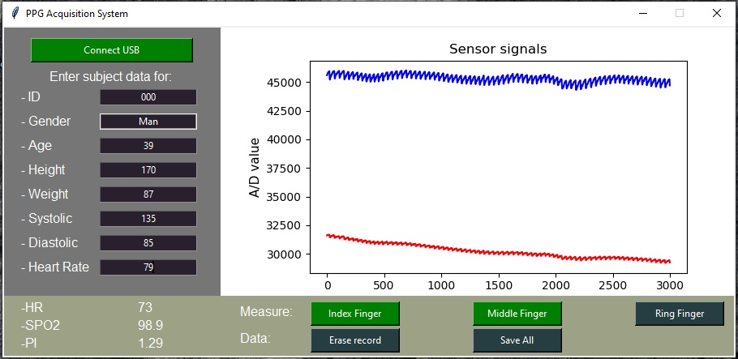

# Windows-Forms-Photoplethysmogram-for-PPG-data-acquisition
This application is intended to be used for creating a database for machine learning projects. Subjects physical data and blood pressure, measured from an external device are entered. The measurement system that is part of this solution provides PPG signals of observed persons in real time from hardware. This hardware system is based on embedded device for sensing and Python source code for data processing. It is a non-invasive light reflective method with two wavelengths.
## Hardware

Hardware consists of two development boards from MikroElektronika.
[Hart rate click](https://www.mikroe.com/heart-rate-click) have MAX30100 pulse oximeter integrated circuit.
[PIC clicker](https://www.mikroe.com/clicker-pic18fj) is board that have microcontroller, micro BUS and USB port.
Firmware SPO2.hex must be downloaded to PIC clicker. It’s possible through integrated Bootloader or with mikroProg for PIC programmer.
It’s sending values of reflected Infrared and Red lights via USB that is defined as a virtual COM-port. Frequency of acquisition is 50 Hz.
This Firmware is developed using two libraries: “Virtual COM Port Demo” and “Heart rate click” form MIKROE libstock site.

## Windows Forms Application

Windows Forms Application named “PPG Acquisition System” collects: entered, calculated, and measured data into one textual file in CSV format. Each subject should have its own file that bears the name of that subject ID. Entered values are: ID, Gender, Age, Height, Weight, Systolic Pressure, Diastolic Pressure, and Heart Rate. Calculated values from PPG signal are: Heart Rate HR, Blood Saturation SPO2, and Perfusion Index PI. Measured data are PPG signal from subjects three fingers, measured with 16bit precision and two wavelengths with reflected method. 
